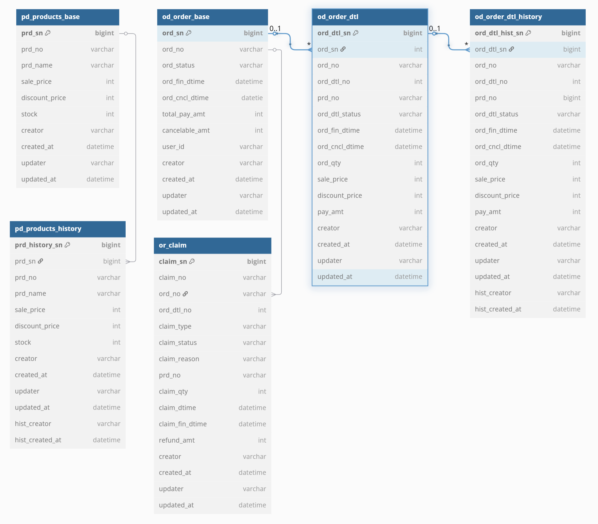

# ssg-order-api

> SSG 사전 과제 주문 API
>
> [목차]
>
> 1. 서비스 기술 스택
> 2. 테이블 ERD 설계
> 3. 프로젝트 구조
> 4. 추후 서비스 확장 시 고려할 부분

### 0. API 설명

- 주문생성: 상품번호 및 주문수량을 입력값으로 받아 주문을 생성합니다.
- 주문취소: 주문번호 및 상품번호를 입력값으로 받아 주문을 취소합니다.
- 주문조회: 주문번호를 입력값으로 받아 주문 목록을 반환합니다.

### 1. 서비스 기술 스택

|    분류    | 기술                           |
| :--------: | ------------------------------ |
|  Language  | Java17                         |
| Framework  | Spring boot 3.5.0              |
| Build Tool | Gradle                         |
|    ORM     | Spring Data JPA                |
|  API Doc   | springdoc-openapi + Swagger UI |
|  Testing   | JUnit5, Mockito                |

※ 각 API 는 복잡한 쿼리를 요구하지않으므로 JPA를 선택했습니다.

### 2. 테이블 ERD 설계



#### 2.1 PD_PRODUCTS_BASE(상품 기본 테이블)

|     컬럼명     |   타입    |      설명      |
| :------------: | :-------: | :------------: |
|     PRD_SN     |  NUMBER   |       PK       |
|     PRD_NO     |  VARCHAR  |    상품번호    |
|    PRD_NAME    |  VARCHAR  |     상품명     |
|   SALE_PRICE   |  NUMBER   |    판매가격    |
| DISCOUNT_PRICE |  NUMBER   |    할인금액    |
|     STOCK      |  NUMBER   |      재고      |
|    CREATOR     |  VARCHAR  |  시스템생성자  |
|   CREATED_AT   | TIMESTAMP | 시스템생성시각 |
|    UPDATEDR    |  VARCHAR  |  시스템수정자  |
|   UPDATED_AT   | TIMESTAMP | 시스템수정시각 |

#### 2.2 PD_PRODUCTS_HISTORY(상품 이력 테이블)

> 재고 및 상품 변경 이력 관리용.
>
> 상품 변경 전의 상태를 snapshot 형태로 저장합니다.

|     컬럼명      |   타입    |     설명     |
| :-------------: | :-------: | :----------: |
| PRD_HISTORY_SN  |  NUMBER   |      PK      |
|     PRD_SN      |  NUMBER   |      FK      |
|     PRD_NO      |  VARCHAR  |   상품번호   |
|    PRD_NAME     |  VARCHAR  |    상품명    |
|   SALE_PRICE    |  NUMBER   |   판매가격   |
| DISCOUNT_PRICE  |  NUMBER   |   할인금액   |
|      STOCK      |  NUMBER   |     재고     |
|     CREATOR     |  VARCHAR  |    생성자    |
|   CREATED_AT    | TIMESTAMP |   생성시각   |
|    UPDATEDR     |  VARCHAR  |    수정자    |
|   UPDATED_AT    | TIMESTAMP |   수정시각   |
|  HIST_CREATOR   |  VARCHAR  |  이력생성자  |
| HIST_CREATED_AT | TIMESTAMP | 이력생성시각 |

#### 2.3 OD_ORDER_BASE(주문 기본 테이블)

> PK와 비즈니스키가 따로 있습니다.

|     컬럼명     |   타입    |       설명       |
| :------------: | :-------: | :--------------: |
|     ORD_SN     |  NUMBER   |        PK        |
|     ORD_NO     |  VARCHAR  |     주문번호     |
|   ORD_STATUS   |  VARCHAR  |     주문상태     |
| ORD_FIN_DTIME  | TIMESTAMP |   주문완료시각   |
| ORD_CNCL_DTIME | TIMESTAMP |   주문취소시각   |
| TOTAL_PAY_AMT  |  NUMBER   |    총결제금액    |
| CANCELABLE_AMT |  NUMBER   | 남은취소가능금액 |
|    USER_ID     |  VARCHAR  |   주문자아이디   |
|    CREATOR     |  VARCHAR  |      생성자      |
|   CREATED_AT   | TIMESTAMP |     생성시각     |
|    UPDATER     |  VARCHAR  |      수정자      |
|   UPDATED_AT   | TIMESTAMP |     수정시각     |

#### 2.4 OD_ORDER_DTL(주문 상세 테이블)

> OD_ORDER_BASE(주문기본테이블)과 1:N 관계에 있습니다.

|     컬럼명     |   타입    |     설명     |
| :------------: | :-------: | :----------: |
|   ORD_DTL_SN   |  NUMBER   |      PK      |
|     ORD_SN     |  NUMBER   |      FK      |
|     ORD_NO     |  VARCHAR  |   주문번호   |
|   ORD_DTL_NO   |  NUMBER   | 주문상세번호 |
|     PRD_NO     |  VARCHAR  |   상품번호   |
| ORD_DTL_STATUS |  VARCHAR  | 주문상세상태 |
| ORD_FIN_DTIME  | TIMESTAMP | 주문완료시각 |
| ORD_CNCL_DTIME | TIMESTAMP | 주문취소시각 |
|    ORD_QTY     |  NUMBER   |   주문수량   |
|   SALE_PRICE   |  NUMBER   |   판매가격   |
| DISCOUNT_PRICE |  NUMBER   |   할인금액   |
|    PAY_AMT     |  NUMBER   |   결제금액   |
|    CREATOR     |  VARCHAR  |    생성자    |
|   CREATED_AT   | TIMESTAMP |   생성시각   |
|    UPDATER     |  VARCHAR  |    수정자    |
|   UPDATED_AT   | TIMESTAMP |   수정시각   |

#### 2.5 OD_ORDER_DTL_HISTORY(주문상세 이력 테이블)

> 주문 상세 이력 관리용.
>
> 주문 상세 변경 전의 상태를 snapshot 형태로 저장합니다.

|     컬럼명      |   타입    |       설명       |
| :-------------: | :-------: | :--------------: |
| ORD_DTL_HIST_SN |  NUMBER   |        PK        |
|   ORD_DTL_SN    |  NUMBER   |        FK        |
|     ORD_SN      |  NUMBER   | 주문기본일련번호 |
|     ORD_NO      |  VARCHAR  |     주문번호     |
|   ORD_DTL_NO    |  NUMBER   |   주문상세번호   |
|     PRD_NO      |  VARCHAR  |     상품번호     |
| ORD_DTL_STATUS  |  VARCHAR  |   주문상세상태   |
|  ORD_FIN_DTIME  | TIMESTAMP |   주문완료시각   |
| ORD_CNCL_DTIME  | TIMESTAMP |   주문취소시각   |
|     ORD_QTY     |  NUMBER   |     주문수량     |
|   SALE_PRICE    |  NUMBER   |     판매가격     |
| DISCOUNT_PRICE  |  NUMBER   |     할인금액     |
|     PAY_AMT     |  NUMBER   |     결제금액     |
|     CREATOR     |  VARCHAR  |      생성자      |
|   CREATED_AT    | TIMESTAMP |     생성시각     |
|     UPDATER     |  VARCHAR  |      수정자      |
|   UPDATED_AT    | TIMESTAMP |     수정시각     |
|  HIST_CREATOR   |  VARCHAR  |    이력생성자    |
| HIST_CREATED_AT | TIMESTMAP |   이력생성시각   |

#### 2.6 OR_CLAIM(클레임 테이블)

|     컬럼명      |   타입    |      설명      |
| :-------------: | :-------: | :------------: |
|    CLAIM_SN     |  NUMBER   |       PK       |
|    CLAIM_NO     |  VARCHAR  |   클레임번호   |
|     ORD_NO      |  VARCHAR  |    주문번호    |
|   ORD_DTL_NO    |  NUMBER   |  주문상세번호  |
|   CLAIM_TYPE    |  VARCHAR  |   클레입타입   |
|  CLAIM_STATUS   |  VARCHAR  |   클레임상태   |
|  CLAIM_REASON   |  VARCHAR  |   클레임이유   |
|     PRD_NO      |  VARCHAR  |    상품번호    |
|    CLAIM_QTY    |  NUMBER   |   클레임수량   |
|   CLAIM_DTIME   | TIMESTAMP |   클레임시각   |
| CLAIM_FIN_DTIME | TIMESTAMP | 클레임완료시각 |
|   REFUND_AMT    |  NUMBER   |    환불금액    |
|     CREATOR     |  VARCHAR  |     생성자     |
|   CREATED_AT    | TIMESTAMP |    생성시각    |
|     UPDATER     |  VARCHAR  |     수정자     |
|   UPDATED_AT    | TIMESTAMP |    수정시각    |


### 3. 프로젝트 구조

#### 3.1 서비스단 구조

```tex
ssg-order-api/
└── src/
    └── main/
        ├── java/
        │   └── com/
        │       └── ssg_order/
        │           └── ssg_order_api/
        │               ├── SsgOrderApiApplication.java   메인 클래스
        │				│
        │               ├── common/                       공통 클래스 (예: 예외, 유틸)
        │               │   ├── exception/
        │               │   └── util/
        │				│
        │				│
        │               ├── order/
        │               │   ├── controller/               주문 API 컨트롤러
        │               │   │	└── dto/                  주문 관련 요청/응답 DTO
        │               │   ├── entity/                   주문/주문상세 Entity
        │               │   ├── repository/               주문 Repository
        │               │   └── service/                  주문 서비스 로직
        │				│
        │               ├── product/
        │               │   ├── controller/
        │               │   ├── dto/
        │               │   ├── entity/
        │               │   ├── repository/
        │               │   └── service/
        │				│
        │               └── claim/                        주문취소(클레임) 관련
        │                   ├── dto/
        │                   ├── entity/
        │                   ├── repository/
        │                   └── service/
        │
        └── resources/
            └── application.properties             		   환경설정

```

#### 3.2 테스트단 구조

```tex
test/
└── java/com/ssg_order/ssg_order_api/
    ├── order/
    │   └── OrderServiceTest.java    <-- 주문 관련 유닛 테스트
    └── claim/
    └── ClaimServiceTest.java    <-- 주문취소 유닛 테스트
```


### 4.  추후 서비스 확장 시 고려할 부분

#### 4.1 재고관리 별도 테이블 생성

> 현재는 단일 재고 수치를 기준으로 상품 테이블에 재고 정보를 포함하고 있지만,
>  추후 다수의 물류 창고 또는 판매 채널 단위로 재고를 별도 관리해야 하는 요구가 발생할 수 있습니다.
>  이 경우, 재고 관리를 위한 별도의 테이블을 생성하여 창고/채널별 재고 수량을 분리 관리하는 구조로 확장하는 것이 바람직합니다.

#### 4.2 결제 테이블 별도 생성

> 현재는 결제에 대한 별도 테이블 없이 주문 정보 내에서 결제 금액만 관리하고 있지만,
>  추후 다양한 결제 수단(신용카드, 포인트, 쿠폰, 간편결제 등)이 도입될 경우,
>  주문별로 결제 수단과 결제 상태를 상세히 관리할 수 있는 별도의 **결제 테이블** 구성이 필요합니다.

#### 4.3 배송지 테이블

> 향후 주문 건별 배송 상태 추적, 송장 번호 관리, 택배사 정보 연동 등이 필요해질 경우를 대비해
>  **배송지 및 배송 상태 관리 테이블** 구성이 요구됩니다.

#### 4.4 클레임 고도화

> 여러 개의 주문 상세를 선택하여 부분 취소하거나 수량 단위로 취소할 수 있는 기능을 제공하기 위해, 클레임 상세 테이블이 별도로 필요할 것으로 보입니다.

#### 4.5 주문 프로세스 시큐어 코딩 강화

> 고객의 보유 포인트 및 할인 쿠폰에 대한 검증을 강화하고, PG 결제 시 별도의 PG 세션을 관리함으로써 주문 프로세스를 더욱 견고하게 만들 수 있습니다.

※ 이외에도 많은 개선점이 존재합니다!

### 5. 테스트 사전준비

#### 5.1 상품 정보 INSERT

```sql
INSERT INTO pd_products_base
  (prd_no, prd_name, sale_price, discount_price, stock, creator, created_at, updater, updated_at, version)
VALUES
  ('1000000001', '이마트 생수',        800,  100, 1000, 'sujin', NOW(), 'sujin', NOW(), 0),
  ('1000000002', '신라면 멀티팩',    4200, 500,  500,  'sujin', NOW(), 'sujin', NOW(), 0),
  ('1000000003', '바나나 한 송이',   3500, 300,  200,  'sujin', NOW(), 'sujin', NOW(), 0),
  ('1000000004', '삼겹살 500g',     12000,2000,  100,  'sujin', NOW(), 'sujin', NOW(), 0),
  ('1000000005', '오리온 초코파이',   3000, 400,  300,  'sujin', NOW(), 'sujin', NOW(), 0);
```

####  5.2 Postman 파라미터

- 주문생성( POST)

> http://localhost:8080/order/create

```json
{
    "orderCreateRequestItemList": [
        {
            "prdNo": "1000000003",
            "ordQty": 5
        },
        {
            "prdNo": "1000000004",
            "ordQty": 3
        }
    ]
}
```

- 주문취소(PATCH)

> http://localhost:8080/claim/cancel

```json
{
  "ordNo": "20250610-F6A5F5", // 생성한 주문번호로 바꿔서
  "prdNo": "1000000003"
}
```

- 주문조회(POST)

> http://localhost:8080/order/orderList

```json
{
  "ordNo": "20250610-F6A5F5", // 생성한 주문번호로 바꿔서
}
```

